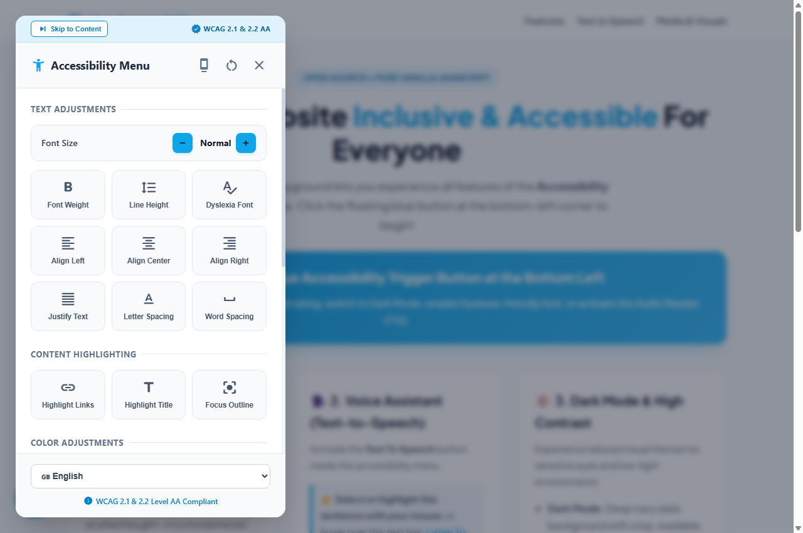
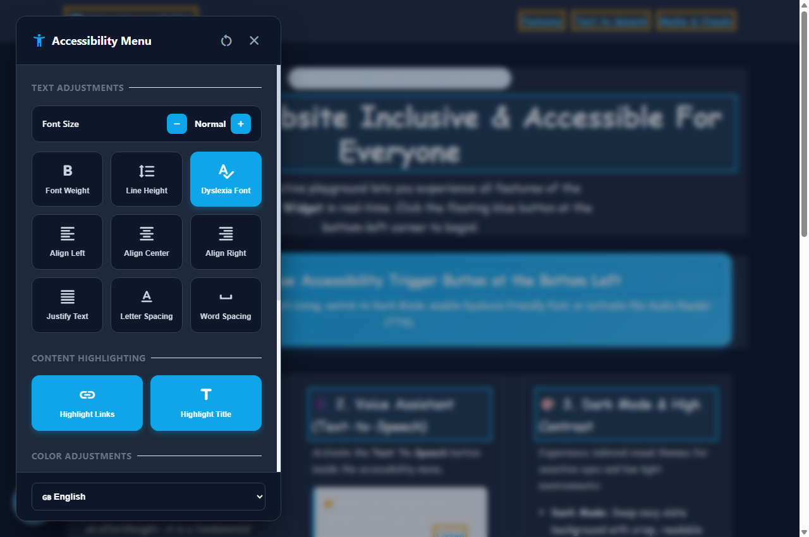
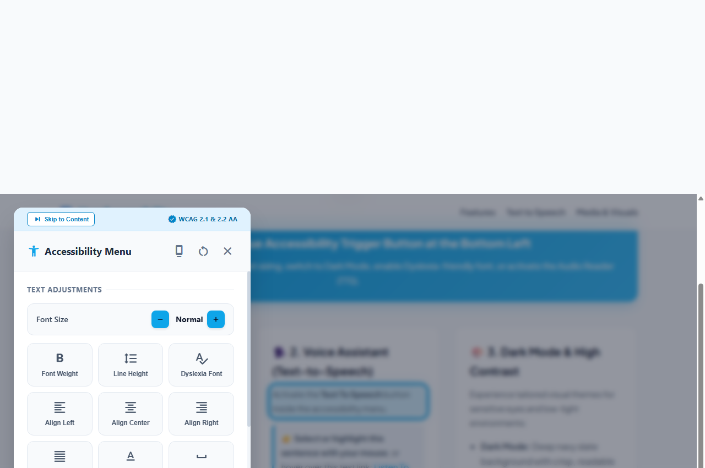
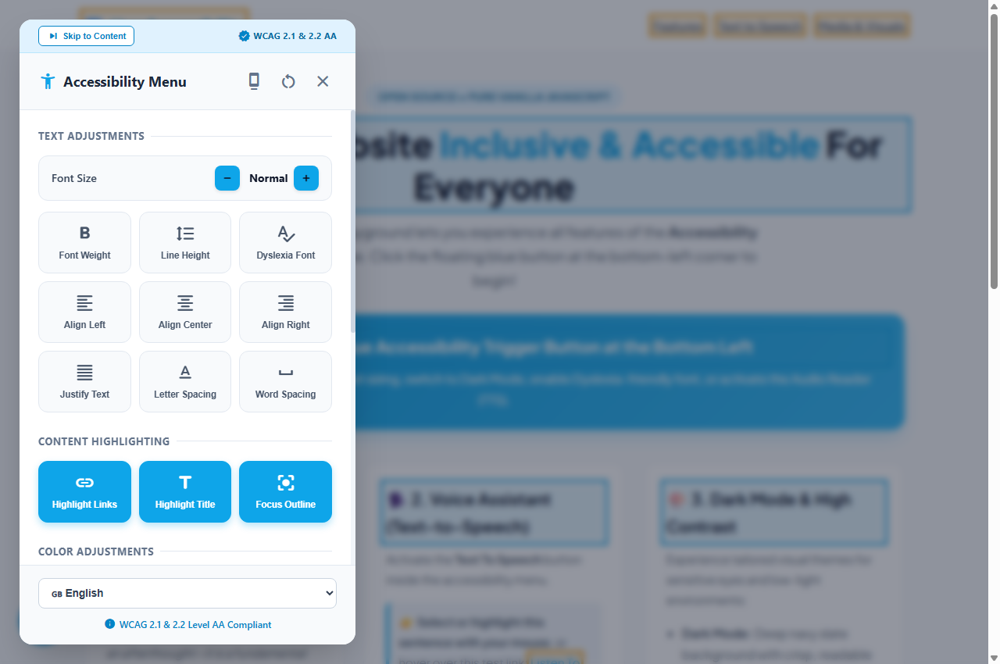

<div align="center">

# ♿ User Accessibility Widget (a11y)
### *Empower Every User: Lightweight, Plug-and-Play Accessibility for the Modern Web*

[](LICENSE)
[](https://developer.mozilla.org/en-US/docs/Web/JavaScript)
[-green.svg?style=for-the-badge)](https://github.com/aaafarrr/User-Accessibility)
[](https://github.com/aaafarrr/User-Accessibility/pulls)
[](https://www.w3.org/WAI/standards-guidelines/wcag/)

<br />

<p align="center">
  
</p>

[**Live Demo**](index.html) • [**WCAG Compliance**](#-wcag-21--22-level-aa-compliance) • [**Features**](#-features) • [**Real Screenshots**](#-screenshots--showcase-live-in-action) • [**Quick Start**](#-quick-start) • [**Configuration**](#-configuration--options)

</div>

---

## 🌟 Overview

**User Accessibility Widget** is a sleek, drop-in, zero-dependency accessibility tool built with **pure Vanilla JavaScript**. Engineered to help developers achieve **full compliance with Web Content Accessibility Guidelines (WCAG) 2.1 & 2.2 Level AA**, Section 508, and the Americans with Disabilities Act (ADA).

Whether your visitors need higher contrast, dyslexia-friendly typography, keyboard-only navigation focus rings, a reading mask spotlight, or automated text-to-speech reading assistance, this widget delivers a modern and inclusive user experience in seconds.

---

## 🛡️ WCAG 2.1 & 2.2 Level AA Compliance

This widget addresses core criteria defined by the W3C Web Accessibility Initiative (WAI):

- **WCAG 2.1 (Keyboard Accessible):** All controls are operable via keyboard; global shortcut <kbd>Alt + A</kbd> toggles the menu instantly.
- **WCAG 2.4.1 (Bypass Blocks):** Includes a prominent one-click "Skip to Content" button to bypass header navigation.
- **WCAG 2.4.7 (Focus Visible):** "Focus Outline" feature injects vibrant neon focus boundaries on `:focus-visible` elements for motor-impaired users.
- **WCAG 1.4.3 / 1.4.6 (Contrast):** Built-in Dark Mode, Light Mode, Invert Colors (Negative Contrast), and High Contrast filters.
- **WCAG 1.4.12 (Text Spacing):** Live controls for line height, word spacing, letter spacing, and font scaling without breaking page flow.
- **WCAG 2.2.2 (Pause, Stop, Hide):** "Stop Animations" immediately halts CSS keyframes and transitions for motion-sensitive users.

---

## ✨ Features

<table>
  <tr>
    <td width="50%">
      <h3>🔤 Typography & Text</h3>
      <ul>
        <li><strong>Dynamic Font Scaling:</strong> Increase or decrease font sizes smoothly without breaking layouts.</li>
        <li><strong>Dyslexia Friendly Font:</strong> Switch site fonts to specialized readable typography (OpenDyslexic / sans-serif).</li>
        <li><strong>Line & Word Spacing:</strong> Expand line heights and letter/word spacing for easier comprehension.</li>
        <li><strong>Text Alignment:</strong> Force Left, Center, Right, or Justified text alignment.</li>
        <li><strong>Font Boldness:</strong> Instant font-weight enhancement.</li>
      </ul>
    </td>
    <td width="50%">
      <h3>🎨 Visual & Color Comfort</h3>
      <ul>
        <li><strong>Dark Mode & Light Mode:</strong> Inverted color palettes for low-light environments.</li>
        <li><strong>Invert Colors:</strong> Negative contrast with photo/media color preservation.</li>
        <li><strong>High Contrast & Monochrome:</strong> Enhanced black-and-white filters for low-vision readers.</li>
        <li><strong>Saturation Controls:</strong> High or low saturation toggle to reduce sensory overload.</li>
        <li><strong>Highlight Links & Headings:</strong> Distinct colored borders to clarify navigable items.</li>
      </ul>
    </td>
  </tr>
  <tr>
    <td width="50%">
      <h3>🔊 Audio & Cognitive Aids</h3>
      <ul>
        <li><strong>Smart Screen Reader (UserWay-Style):</strong> Floating navigable player bar with Next, Previous, Play/Pause, Speed adjustments (0.8x - 1.5x), live transcript preview, and soundwave equalizer.</li>
        <li><strong>Audio Transition Chimes:</strong> Web Audio API synthetic sound cues played on paragraph transitions (zero audio file dependencies).</li>
        <li><strong>Visual Active Element Highlighting:</strong> Glowing highlight ring around the currently spoken paragraph or heading with smooth auto-scrolling.</li>
        <li><strong>Click-to-Read & Hotkeys:</strong> Click any element to jump reader, or use <kbd>Alt + Right</kbd> (Next), <kbd>Alt + Left</kbd> (Prev), <kbd>Alt + Space</kbd> (Play/Pause).</li>
        <li><strong>Reading Guide & Mask:</strong> Focus ruler and spotlight mask to reduce cognitive fatigue.</li>
        <li><strong>Mute Media:</strong> Instantly silence all autoplay audio and video elements.</li>
      </ul>
    </td>
    <td width="50%">
      <h3>⚡ Navigation, Interaction & Ergonomics</h3>
      <ul>
        <li><strong>Keyboard Shortcut:</strong> Press <kbd>Alt + A</kbd> anywhere to open or close the menu.</li>
        <li><strong>Focus Outline:</strong> High-visibility focus indicators for keyboard navigation (Tab key).</li>
        <li><strong>Skip to Content:</strong> Jump directly to main content container.</li>
        <li><strong>Dock Position Switcher:</strong> Flip button and modal position between bottom-left and bottom-right.</li>
        <li><strong>Big Cursor:</strong> High-visibility oversized cursor pointer.</li>
        <li><strong>Stop Animations:</strong> Freezes CSS transitions and animations for motion-sensitive users.</li>
        <li><strong>Hide Images:</strong> Suppresses images to remove visual clutter and distraction.</li>
        <li><strong>Persistent Preferences:</strong> Saves user settings across sessions using cookies (30 days).</li>
        <li><strong>Bilingual UI:</strong> Instant switching between English (EN) and Indonesian (ID).</li>
      </ul>
    </td>
  </tr>
</table>

---

## 📸 Screenshots & Showcase (Live In-Action)

### 🪟 1. Modern Accessibility Modal Menu
Clean, intuitive, and responsive floating modal menu with complete accessibility controls, position toggling, and bilingual localization:

<p align="center">
  
</p>

### 🌙 2. Dark Mode, High Contrast & Dyslexia-Friendly Font
Instant eye-comfort adjustments for dim lighting and specialized readable typography for readers with dyslexia:

<p align="center">
  
</p>

### 🗣️ 3. Smart Screen Reader with UserWay-Style Navigable Player
Navigable floating player bar featuring Next/Prev controls, transition chimes, reading speed selector, live soundwaves, and illuminated paragraph target highlight:

- **Next sentence:** <kbd>→</kbd> (Right Arrow) or <kbd>Alt + →</kbd>
- **Previous sentence:** <kbd>←</kbd> (Left Arrow) or <kbd>Alt + ←</kbd>
- **Play / Pause:** <kbd>Space</kbd> or <kbd>Alt + Space</kbd>
- **Close Reader:** <kbd>Esc</kbd>

<p align="center">
  
</p>

### 🔗 4. Content Navigation Aids (Links & Headings Highlight)
Clear visual boundaries and highlights on all links and headings to streamline reading and navigation:

<p align="center">
  
</p>

---

## 🚀 Quick Start

### 1. Include the Script
Include `UserAccessibility.min.js` (for production) or `UserAccessibility.js` right before the closing `</body>` tag on your website:

```html
<!-- Production Minified (Recommended) -->
<script src="UserAccessibility.min.js"></script>

<!-- Or Source Version -->
<script src="UserAccessibility.js"></script>
```

That's it! The widget will automatically initialize and place a modern floating button at the bottom-left of the viewport.

---

## ⚙️ Configuration & Options

You can easily customize the widget's theme color, default language, dock position, and container:

```html
<!-- Include script -->
<script src="UserAccessibility.js"></script>

<script>
  // Custom initialization
  document.addEventListener("DOMContentLoaded", () => {
    window.accessibilityApp = new AccessibilityWidget({
      themeColor: "#0ea5e9",         // Brand accent color (Hex)
      defaultLang: "en",             // 'en' (English) or 'id' (Indonesian)
      position: "left",              // 'left' or 'right'
      container: document.body       // Parent element for the widget
    });
  });
</script>
```

### Configuration Parameters

| Option | Type | Default | Description |
| :--- | :--- | :--- | :--- |
| `themeColor` | `String` | `"#0ea5e9"` | Primary accent color for buttons, highlights, and active states. |
| `defaultLang` | `String` | `"en"` | Default UI language (`"en"` or `"id"`). Automatically falls back to document language. |
| `position` | `String` | `"left"` | Initial dock placement of the floating trigger and modal (`"left"` or `"right"`). |
| `container` | `HTMLElement` | `document.body` | DOM element where the widget modal and trigger button are mounted. |

### Programmatic API

```javascript
// Toggle menu modal
window.accessibilityApp.toggleMenu();

// Switch dock position (left / right)
window.accessibilityApp.togglePosition();

// Reset all accessibility overrides to default
window.accessibilityApp.reset();

// Screen reader controls
window.accessibilityApp.startScreenReader();
window.accessibilityApp.stopScreenReader();

// Clean up all DOM elements and event listeners (SPA unmount)
window.accessibilityApp.destroy();
```

---

## 🖥️ Live Demonstration

Test all features locally by launching `index.html`:

1. Clone or download this repository:
   ```bash
   git clone https://github.com/aaafarrr/User-Accessibility.git
   cd User-Accessibility
   ```
2. Open `index.html` in your favorite browser.
3. Click the accessibility icon in the bottom-left corner or press <kbd>Alt + A</kbd> to explore text scaling, dark mode, focus outlines, reading mask, text-to-speech, and more!

---

## 🌐 Browser Compatibility

Tested and fully supported across all modern web browsers:

|  Chrome |  Firefox |  Safari |  Edge |  Opera |
| :---: | :---: | :---: | :---: | :---: |
| Latest ✔ | Latest ✔ | Latest ✔ | Latest ✔ | Latest ✔ |

---

## 🤝 Contributing

Contributions make the open-source community an inspiring place to learn, inspire, and create. Any contributions you make are **greatly appreciated**!

1. Fork the Project
2. Create your Feature Branch (`git checkout -b feature/AmazingFeature`)
3. Commit your Changes (`git commit -m 'Add some AmazingFeature'`)
4. Push to the Branch (`git push origin feature/AmazingFeature`)
5. Open a Pull Request

---

## 📄 License

Distributed under the **MIT License**. See [`LICENSE`](LICENSE) for more information.

<div align="center">
  <sub>Built with ❤️ for a more inclusive and accessible web for everyone. Fully WCAG 2.1 & 2.2 Level AA Compliant.</sub>
</div>
